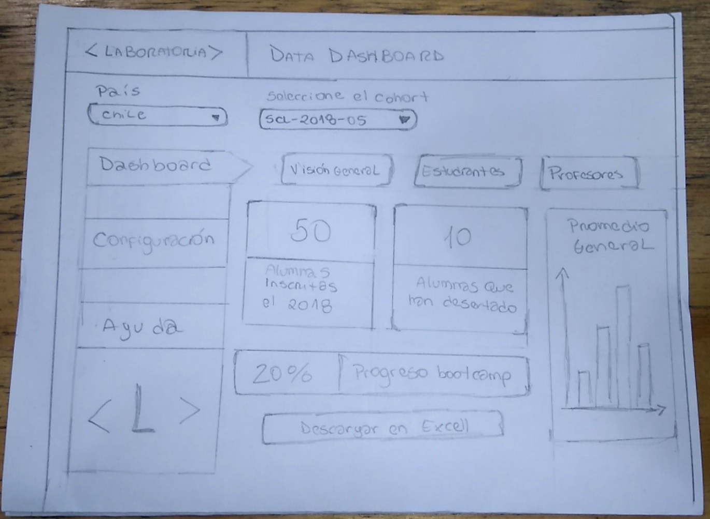
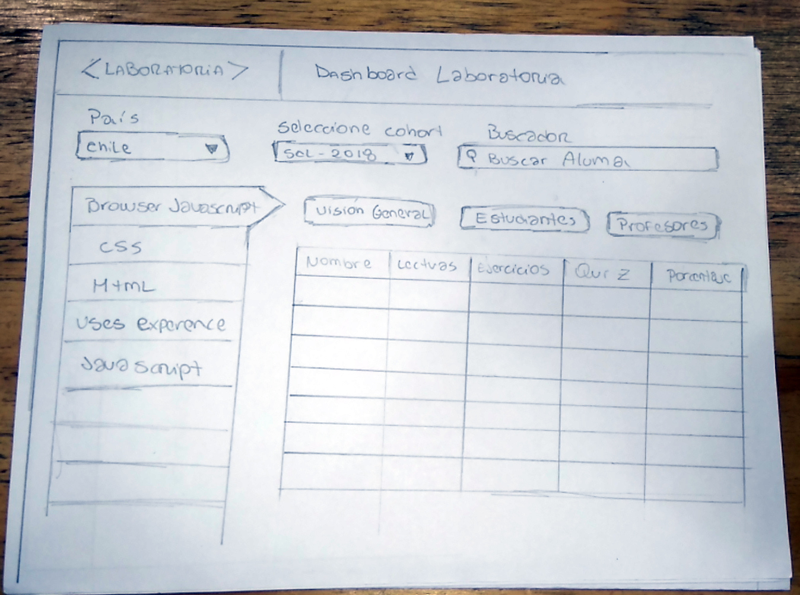
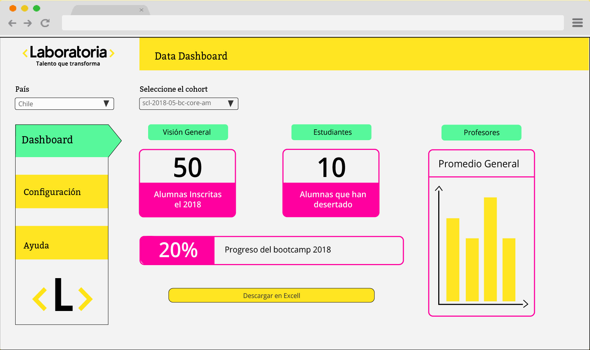
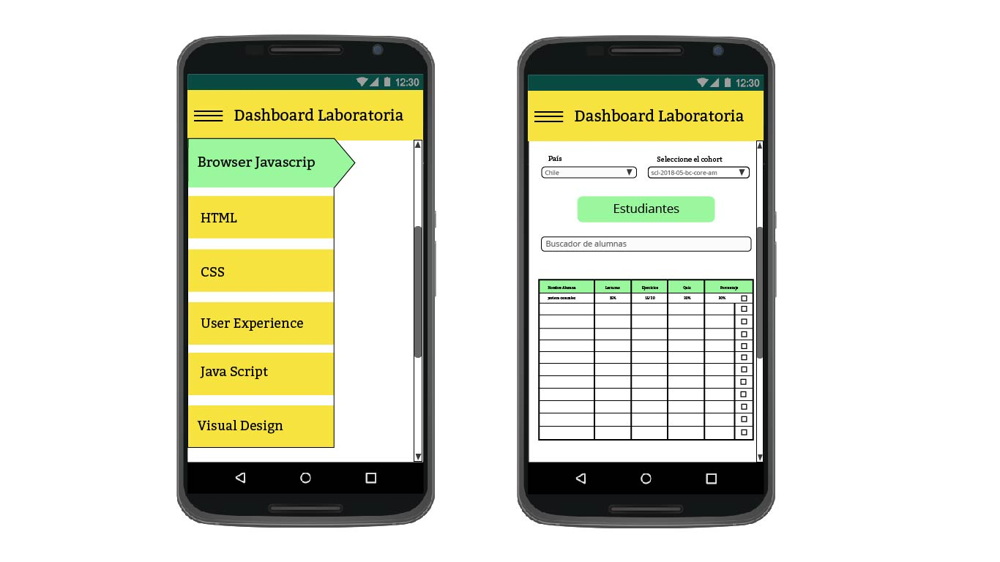

<h1> User Experience Design </h1>
<h2> Definición del producto </h2>

 Nuestro producto es un <b> datadashboard </b> para la <b>Training Managers (TMs)</b> de Laboratoria. Para ello, se realizó una entrevista presencial para conocer cuales eran las expectivas del usuario con el producto y que necesidad necesitaba cubrir con el.

Su objetivo es facilitar el acceso a la información general del desempeño de las alumnas durante el bootcamp o que pasaron ya por este. 

Como principal usuaria del datadashboard, quiere poder seleccionar un cohort de una lista de cohorts. Al seleccionar un cohort, quiere que aparezcan la lista de alumnas que fueron o son parte de el y que a esas alumnas se les permita calcular el porcentaje de progreso de los cursos, calcular el grado de completitud de las lecturas, ejercicios autocorregidos y quizzes. Además de poder filtrar o buscar alumnas por nombre. 

Para ello solicita que su visualización sea similar al LMS y que a su vez sea responsivo, porque desea poder revisar esta información desde su <b>destokp</b> y su <b>celular</b>, con ello podrá trabajar con el datadashboard desde cualquier de estos dispositivos. 

El poder monitorear el progreso de las alumnas de manera detallada le permitirá a la Training Managers poder darle Feedback a las alumnas y a sus respectivas coach sobre su desempeño, con esto también se podrán crear estrategias para ayudar a las alumnas que se van quedando más atrás que el resto. 

<h2> Proceso de diseño </h2>

 Para comenzar a realizar el diseño pensamos en el contenido solicitado por el cliente y de que forma distribuilo para facilitar el uso del datadasboard. 
Primero pensamos en una visualización general que le permite seleccionar el país y cohort que desea conocer, para luego visualizar el cohort, las alumnas y su despempeño en las distintas actividades.
En colores y tipografías se implementaron las oficiales de Laboratoria para así poder continuar con la imagen del LMS. 

2) Sketch de la solución (prototipo de baja fidelidad)
Sketch pantalla de ingreso selecionando país y cohort.

Sketch de pantalla ya ingresado país y cohort y ahora habiendo echo click en estudiantes.

3) Diseño de la Interfaz de Usuario (prototipo de alta fidelidad)

Prototipo de alta fidelidad para pantalla de ingreso con selección de país y cohort.

Prototipo de alta fidelidad para pantalla de estudiantes, el país y cohort fueron seleccionados previamente. 

Prototipo de alta fidelidad para pantalla de responsive. 

